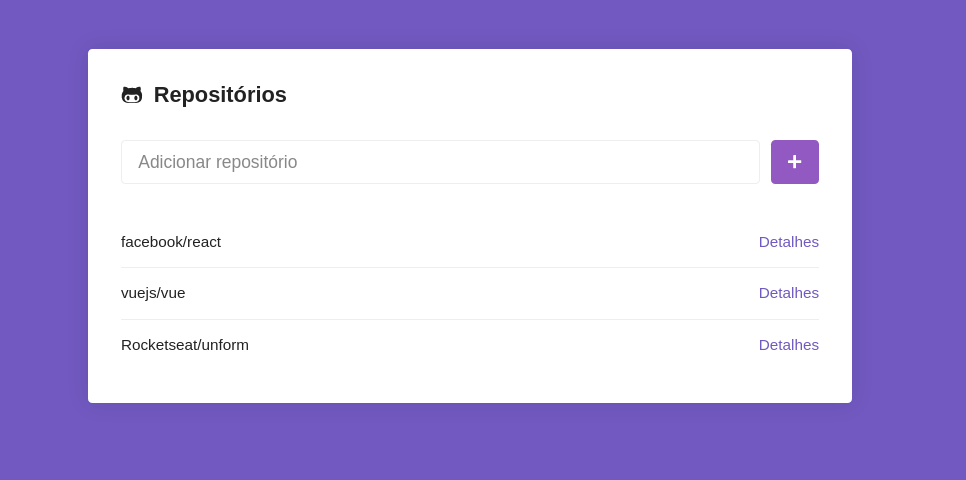
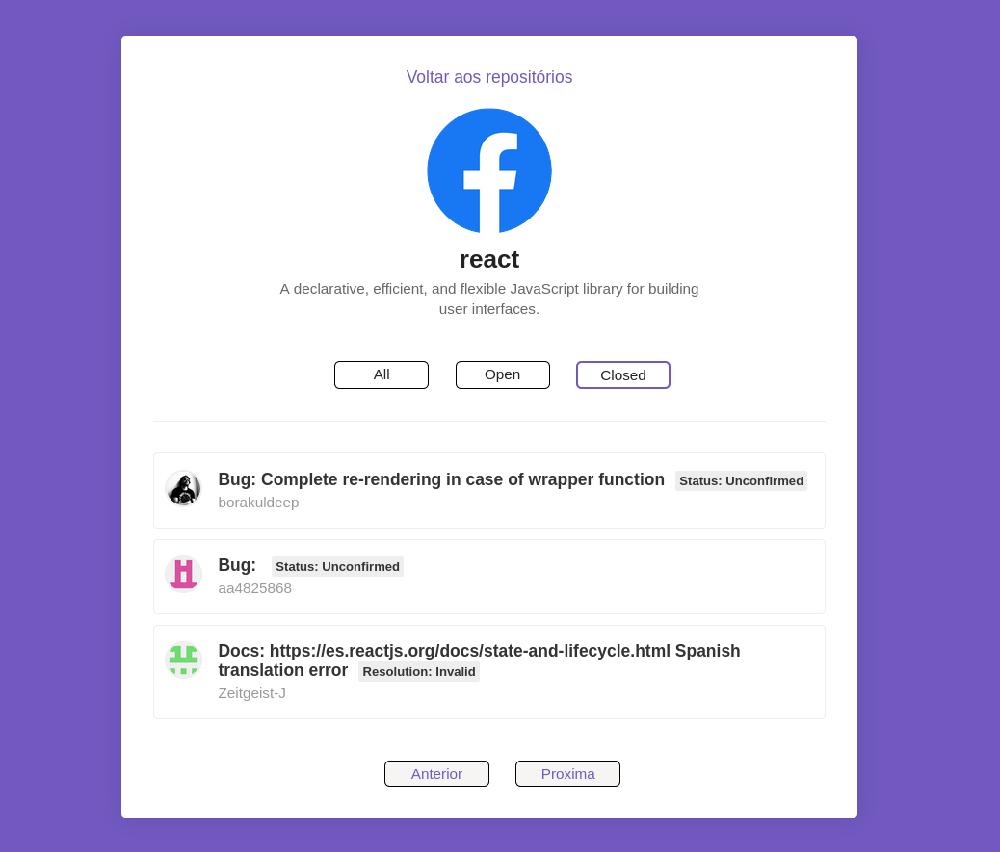

<h1 align="center">
  
</h1>


<h3 align="center">
  :rocket: [Bootcamp GoStack#10] Desafio 05
</h3>

## Desafio
Desenvolver uma aplicação em React que permite cadastrar e consultar repositórios do Github.
A aplicação deverá consumir a API oficial do Github para buscar repositórios e suas Issues.

[Link do Desafio](https://github.com/Rocketseat/bootcamp-gostack-desafio-05)

### Resultado
<h1 align="center">
  
</h1>

<h1 align="center">
  
</h1>


### Subindo a aplicação
```sh
git clone ...
cd bootcamp-gostack-desafio-05
yarn
yarn start
```
